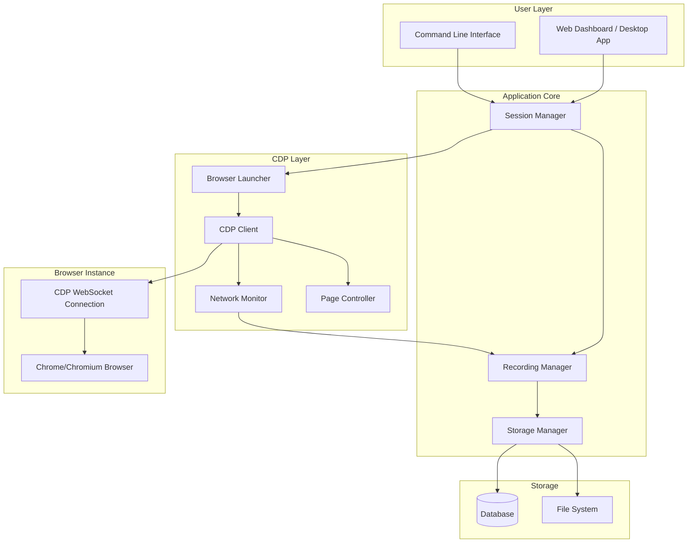
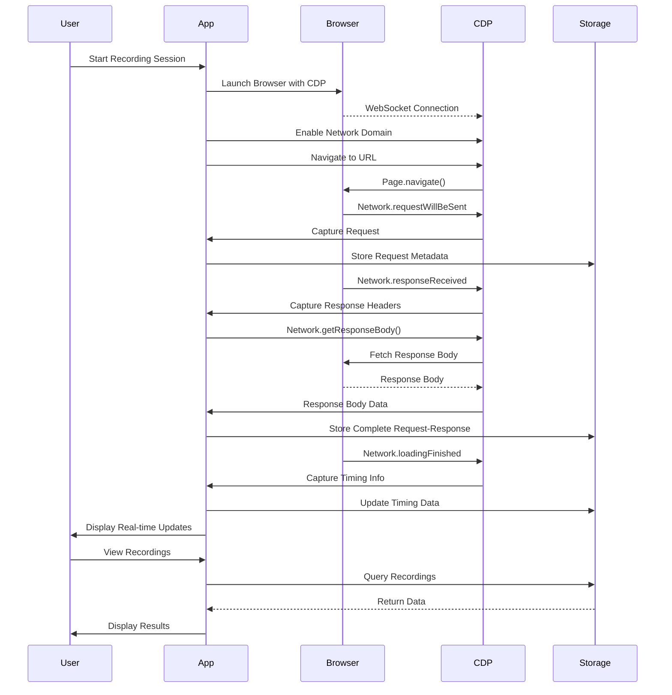
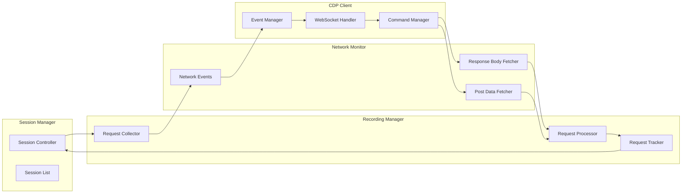
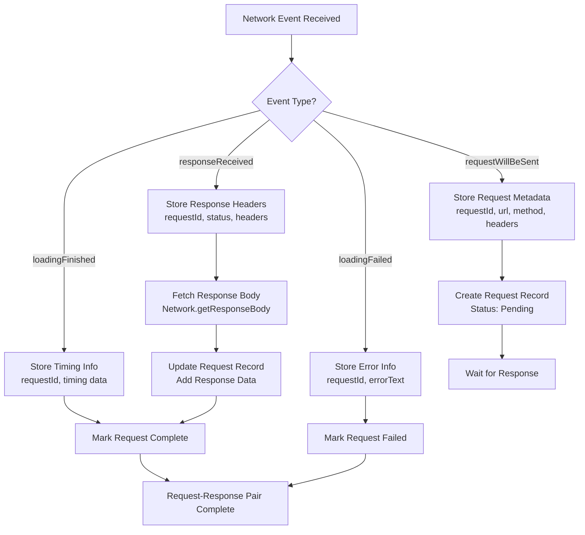
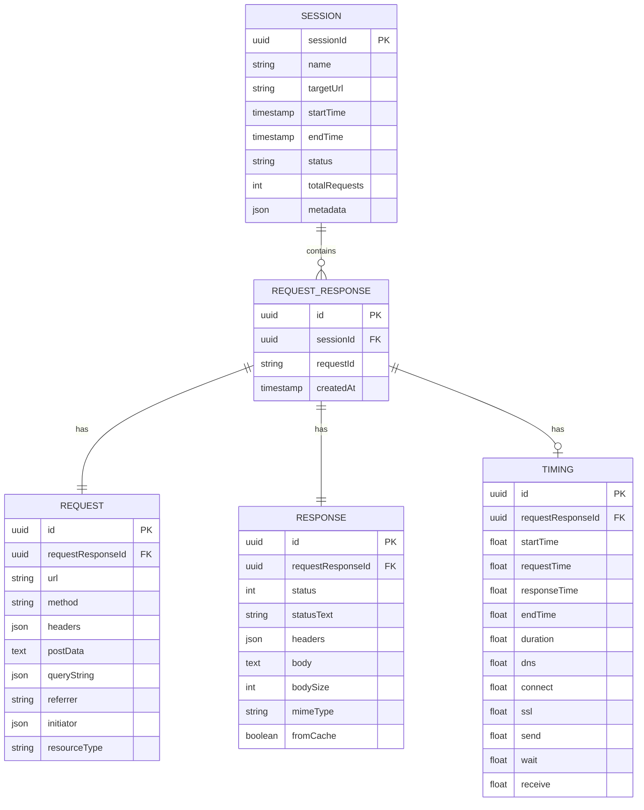
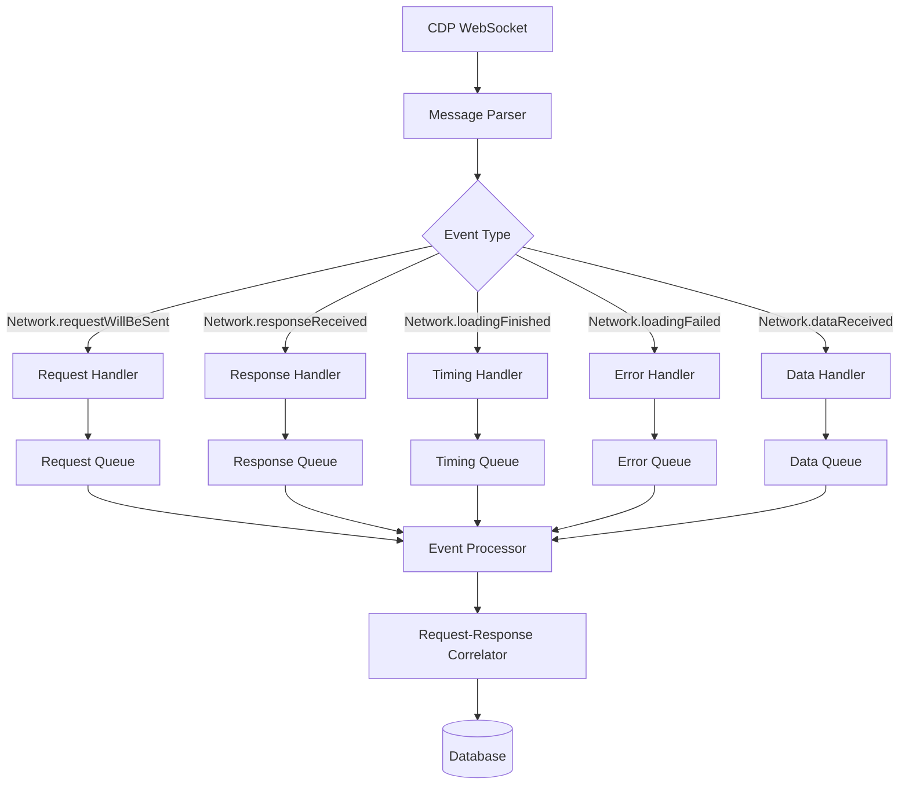
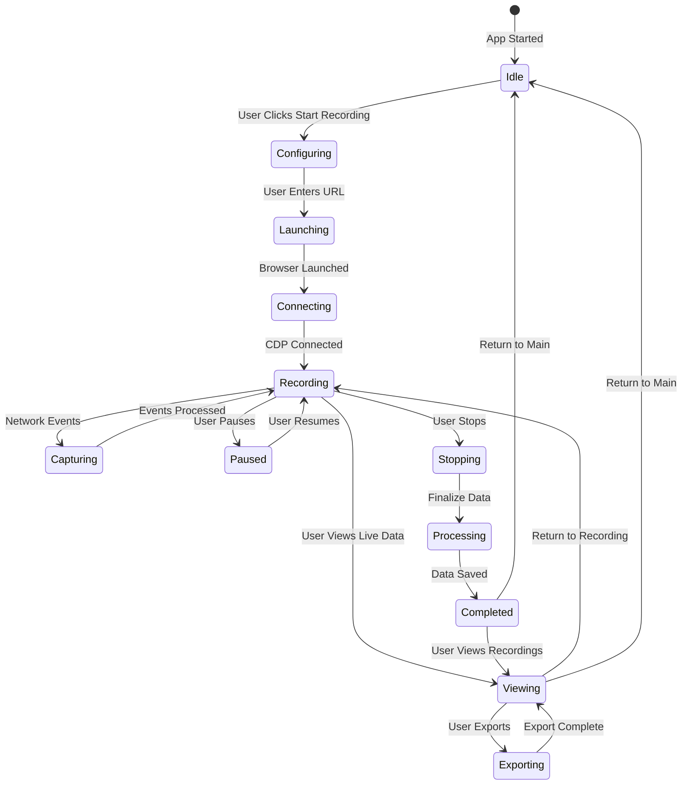
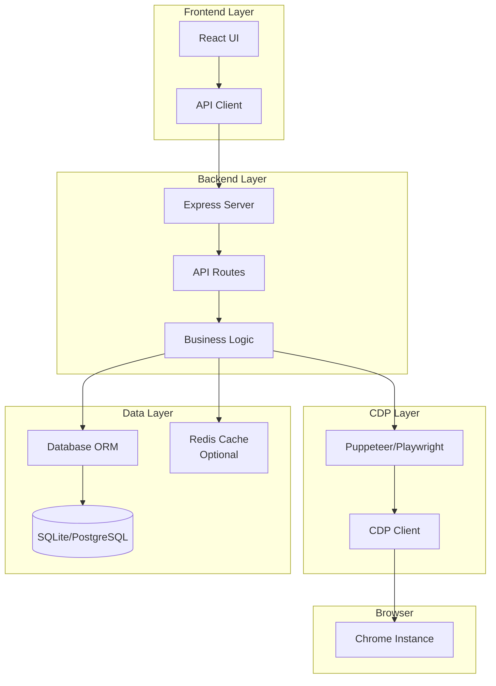
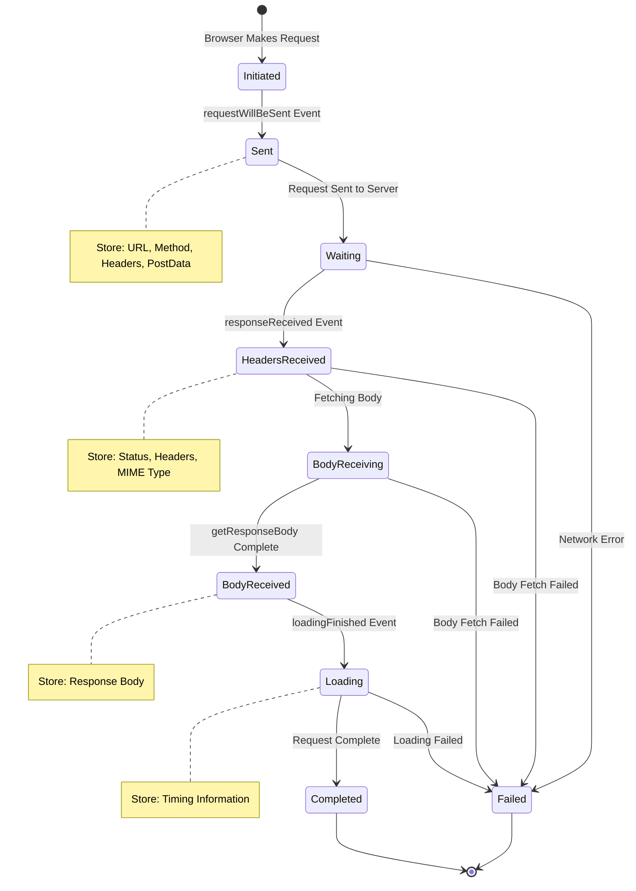

# API Recorder - Architecture Diagrams

## System Architecture Overview

## Data Flow Diagram

## Component Interaction Diagram

## Request-Response Correlation Flow

## Storage Schema Relationship

## CDP Event Processing Pipeline

## User Workflow

## Technology Stack Architecture

## Request Lifecycle

