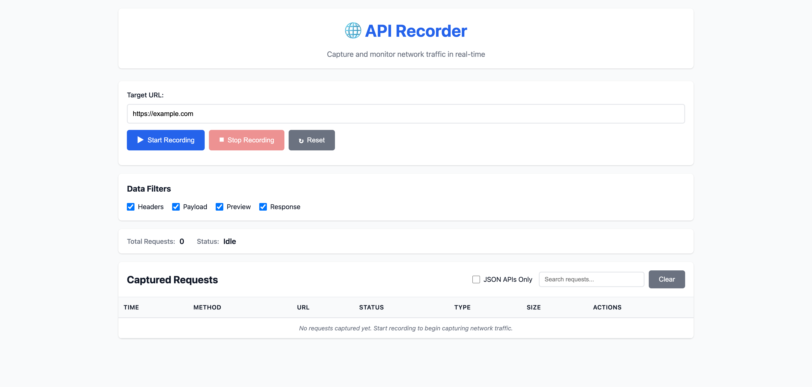

# API Recorder

A powerful application that records all API requests and responses from frontend to backend for any given website using Chrome DevTools Protocol (CDP).



## Features

- 🎯 **Complete Network Capture**: Captures ALL network traffic including Fetch API, XHR, Service Workers, WebSockets, and more
- 🔍 **No Code Injection**: Uses CDP — no need to modify target websites
- 📊 **Real-time Monitoring**: View network traffic as it happens
- 💾 **Persistent Storage**: Store recordings in SQLite database
- 🔎 **Search & Filter**: Find specific requests by URL, method, status, or resource type
- 📤 **Export Support**: Export recordings in HAR or JSON format
- 🚀 **Automation Ready**: Built on Playwright for future automation capabilities

## Architecture

The application is built with a modular architecture:

- **Core Layer**: Browser launcher, CDP client, network monitor
- **Manager Layer**: Session, recording, and storage managers
- **API Layer**: RESTful API for session and request management
- **Storage Layer**: SQLite database for persistent storage

See [ARCHITECTURE.md](./ARCHITECTURE.md) and [SPECIFICATIONS.md](./SPECIFICATIONS.md) for detailed documentation. For a quick introduction, check out the [Quick Start Guide](./QUICK_START.md) or the full [Usage Guide](./USAGE_GUIDE.md).

## Prerequisites

- Node.js >= 18.0.0
- npm or yarn

## Installation

1. Clone the repository:
```bash
git clone <repository-url>
cd APIRecorder
```

2. Install dependencies:
```bash
npm install
```

3. Install Playwright browsers:
```bash
npx playwright install chromium
```

## Usage

### Start the Server

```bash
npm start
```

The server will start on `http://localhost:3000`.

### API Endpoints

#### Sessions

- `GET /api/sessions` - Get all sessions
- `POST /api/sessions` - Create a new session
- `GET /api/sessions/:sessionId` - Get session details
- `POST /api/sessions/:sessionId/start` - Start recording session
- `POST /api/sessions/:sessionId/stop` - Stop recording session
- `DELETE /api/sessions/:sessionId` - Delete session

#### Requests

- `GET /api/sessions/:sessionId/requests` - Get all requests for a session

#### Health

- `GET /api/health` - Health check endpoint

### Example: Create and Start a Recording Session

```bash
# Create a new session
curl -X POST http://localhost:3000/api/sessions \
  -H "Content-Type: application/json" \
  -d '{"name": "My Recording Session"}'

# Start recording (replace SESSION_ID with actual session ID)
curl -X POST http://localhost:3000/api/sessions/SESSION_ID/start \
  -H "Content-Type: application/json" \
  -d '{"targetUrl": "https://example.com"}'

# Stop recording
curl -X POST http://localhost:3000/api/sessions/SESSION_ID/stop

# Get all requests
curl http://localhost:3000/api/sessions/SESSION_ID/requests
```

## Configuration

Edit [`config/default.json`](./config/default.json) to customize:

- Server port and host
- Browser settings (headless, viewport, etc.)
- Storage configuration
- Recording options (max body size, filters, etc.)

## Project Structure

```text
APIRecorder/
├── src/
│   ├── core/              # Core CDP functionality
│   ├── managers/          # Business logic managers
│   ├── models/            # Data models
│   ├── storage/           # Database and storage
│   ├── utils/             # Utility functions
│   ├── api/               # API routes
│   └── index.js           # Application entry point
├── ui/                    # Web dashboard (to be implemented)
├── config/                # Configuration files
├── tests/                 # Test files
├── docs/                  # Documentation
└── data/                  # Database files (created at runtime)
```

## Development

### Run in Development Mode

```bash
npm run dev
```

### Run Tests

```bash
npm test
```

For more details on testing, see the [Testing Guide](./tests/TESTING_GUIDE.md).

## Technology Stack

- **Playwright**: Browser automation and CDP access
- **Express**: Web server and API
- **SQLite**: Database storage
- **Node.js**: Runtime environment

## Future Enhancements

- Web dashboard UI
- Request replay functionality
- MCP tools generation for automation
- Agent-based automation workflows
- Performance analysis
- Team collaboration features

## License

MIT
