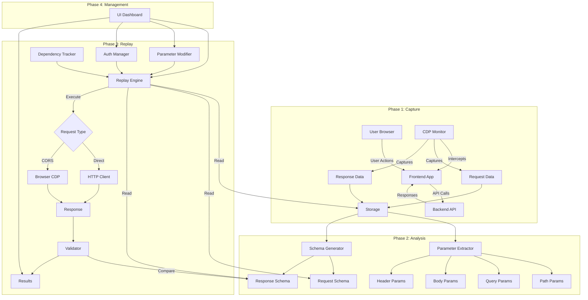
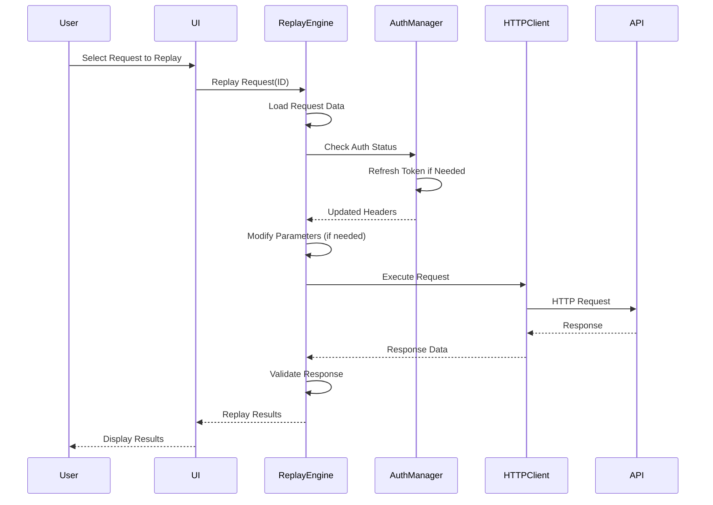
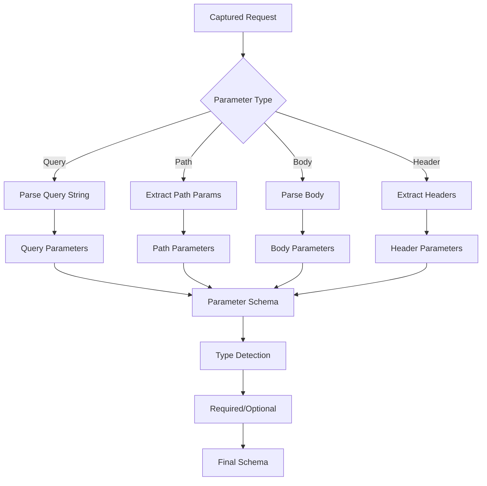

# Automatic API Invocation Architecture

## System Flow Diagram



## Request Replay Flow



## Parameter Extraction Flow



## Dependency Tracking

```mermaid
graph LR
    A[Request 1: POST /login] -->|Extract token| B[Token Variable]
    B -->|Inject| C[Request 2: GET /profile]
    
    C -->|Extract userId| D[UserId Variable]
    D -->|Inject| E[Request 3: GET /users/:id]
    
    E -->|Extract postId| F[PostId Variable]
    F -->|Inject| G[Request 4: GET /posts/:id]
    
    style A fill:#e1f5ff
    style C fill:#fff4e1
    style E fill:#fff4e1
    style G fill:#fff4e1
```



## Implementation Components

### 1. Replay Engine
```javascript
class APIReplayEngine {
  async replay(requestId, options = {}) {
    // Load request
    // Apply modifications
    // Execute request
    // Return response
  }
  
  async replayBatch(requestIds, options = {}) {
    // Replay multiple requests
    // Support parallel or sequential
  }
}
```

### 2. Parameter Extractor
```javascript
class ParameterExtractor {
  extractPathParams(url, pattern) {
    // Extract :id, :userId, etc.
  }
  
  extractQueryParams(queryString) {
    // Parse query string
  }
  
  extractBodyParams(body) {
    // Parse JSON/form-data body
  }
}
```

### 3. Schema Generator
```javascript
class SchemaGenerator {
  generateRequestSchema(request) {
    // Generate JSON Schema from request
  }
  
  generateResponseSchema(response) {
    // Generate JSON Schema from response
  }
}
```

### 4. Auth Manager
```javascript
class AuthManager {
  async refreshToken(session) {
    // Refresh expired tokens
  }
  
  extractToken(response) {
    // Extract token from response
  }
  
  injectToken(request, token) {
    // Inject token into request headers
  }
}
```

### 5. Dependency Tracker
```javascript
class DependencyTracker {
  buildGraph(requests) {
    // Build dependency graph
  }
  
  extractVariables(response) {
    // Extract variables from response
  }
  
  injectVariables(request, variables) {
    // Inject variables into request
  }
}
```
